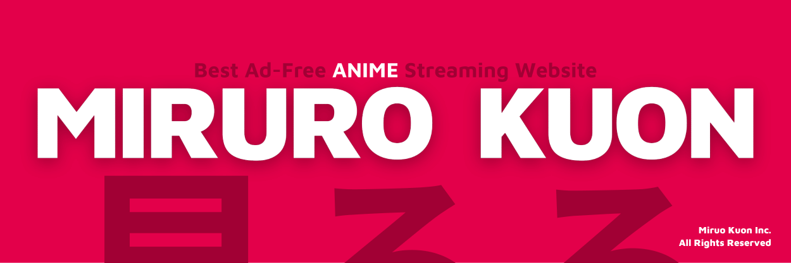

<h1 align="center">
  <p align="center"><strong>Miruro</strong></p>
  <a href="https://github.com/akionii/Miruro/blob/master/public/assets/img/Cover.png"></a>
  
  見るろ 久遠
</h1>


<p align="center">
<a href="#"></a>
<a href="#"></a>
<a href="#"></a>
<a href="#"></a>
<a href="#"></a>
<a href="#"></a>
<a href="#"></a>
</p>

> Miruro's api and backend dev will be available at **[Release v2.0.0](#)** and production website is already available on **[Miruro.vercel.app](https://miruro.vercel.app)**

---
## **Introduction**

Miruro is an Anime Streaming Site with minimal UI and ad-free anime streaming experience.

Wanna know more about us? Check out our **[Docs](https://akionii.github.io/Miruro/docs)**!

**Backend**: Will work on **[Miruro-api](https://miruro-api.vercel.app)** with /routes for trending, favourites and popular.


---
## **For Devs**

```ruby
Miruro:
    ├───.github
    │   ├───ISSUE_TEMPLATE
    │   └───workflows
    ├───public
    │   └───assets
    └───src
        ├───components
        │   ├───Footer
        │   ├───Home
        │   ├───Navigation
        │   ├───skeletons
        │   ├───VideoPlayer
        │   └───WatchAnime
        ├───hooks
        ├───pages
        └───styles
```

### **Contributing**
Read the **[Contributing Docs](.github/CONTRIBUTING.md)** before contributing. We are thankful for any contributions from you.

**`Some more useful documents:`**
- **[Issue Template](.github/ISSUE_TEMPLATE/bug_report.md)**
- **[Code Of Conduct](.github/CODE_OF_CONDUCT.md)**
- **[Legals](/LICENSE)**

### **CLI Downloader**

 **```Work In Progress - 16%```**

 

---
## **LICENSE**
```
MIT License

Copyright (c) 2022 akionii

Permission is hereby granted, free of charge, to any person obtaining a copy
of this software and associated documentation files (the "Software"), to deal
in the Software without restriction, including without limitation the rights
to use, copy, modify, merge, publish, distribute, sublicense, and/or sell
copies of the Software, and to permit persons to whom the Software is
furnished to do so, subject to the following conditions:

The above copyright notice and this permission notice shall be included in all
copies or substantial portions of the Software.

THE SOFTWARE IS PROVIDED "AS IS", WITHOUT WARRANTY OF ANY KIND, EXPRESS OR
IMPLIED, INCLUDING BUT NOT LIMITED TO THE WARRANTIES OF MERCHANTABILITY,
FITNESS FOR A PARTICULAR PURPOSE AND NONINFRINGEMENT. IN NO EVENT SHALL THE
AUTHORS OR COPYRIGHT HOLDERS BE LIABLE FOR ANY CLAIM, DAMAGES OR OTHER
LIABILITY, WHETHER IN AN ACTION OF CONTRACT, TORT OR OTHERWISE, ARISING FROM,
OUT OF OR IN CONNECTION WITH THE SOFTWARE OR THE USE OR OTHER DEALINGS IN THE
SOFTWARE.
```

---
## **Thanks For Visiting**


Hope you liked it. Wanna support?

- **[Star This Repository](https://github.com/akionii/Miruro)**
- **[Contribute](https://github.com/akionii/Miruro/fork)**
- **[Donate to my Patreon](https://www.patreon.com/biskwt)**
- **[Staff Forms - Coming Soon](https://miruro.live)**
